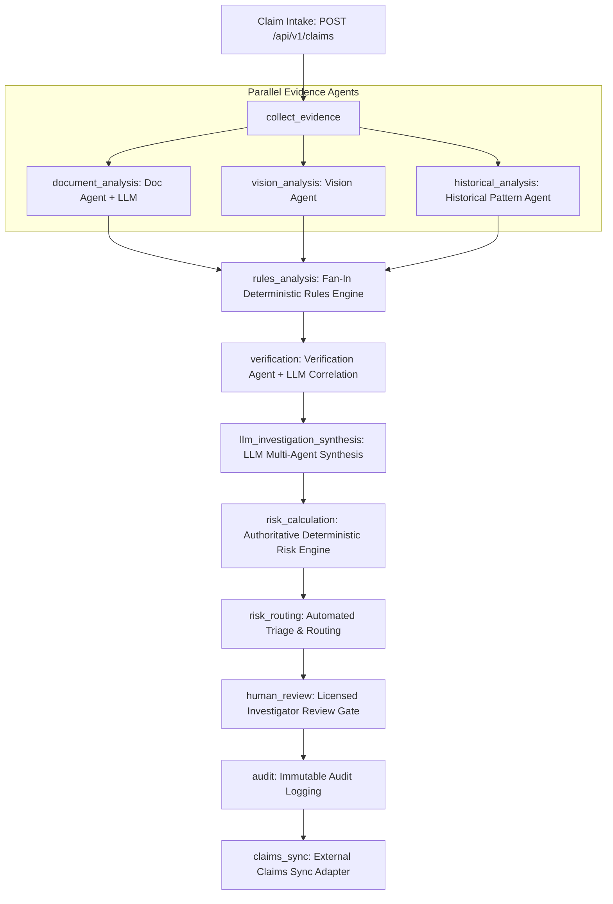

# FraudGuard AI - Enterprise AI Fraud Detection & Investigation Platform

> **An autonomous, explainable, multimodal insurance fraud investigation platform powered by LangGraph & LLMs.**  
> Combines real-time DAG orchestration, parallel evidence extraction (Document, Vision, Historical Pattern Agents), LLM unstructured reasoning synthesis, deterministic business rules, and an authoritative risk engine (0–100) while strictly preserving human investigator authority.

[](https://python.org)
[](https://fastapi.tiangolo.com)
[](https://langchain-ai.github.io/langgraph/)
[](https://reactjs.org)
[](https://tailwindcss.com)
[]()
[]()

---

## 1. Problem Statement & Core Philosophy

Insurance claims fraud accounts for over **\$300 billion in annual losses** globally across property, casualty, and auto insurance. Conventional automated systems typically rely either on rigid keyword blacklists or opaque "black-box" LLM prompts that fail regulatory compliance and cannot be challenged in court.

### The Fundamental Rule:
> **The system NEVER automatically convicts or denies a claim based solely on an AI prediction.**  
> AI models generate explainable risk signals, extract structured facts, synthesize multi-agent findings, and route high-risk files to the **Special Investigation Unit (SIU)**. The deterministic risk engine mathematically bounds the 0–100 risk score, and only a licensed human investigator or adjuster makes the final binding decision.
>
> **"AI recommends. Human decides."**

---

## 2. System Architecture: LangGraph 13-Node DAG

FraudGuard AI employs a hybrid architecture where **LangGraph** orchestrates parallel evidence analysis, deterministic rule evaluation, LLM synthesis, authoritative risk calculation, and human investigator gating.



### 2.1 The 13-Node Pipeline:
1. **`load_claim`**: Ingests claim metadata and verifies coverage parameters.
2. **`collect_evidence`**: Ingests and normalizes uploaded and inline documents, repair estimates, and photographs.
3. **`document_analysis`** *(Parallel Branch)*: Structured LLM extraction of parts, labor hours, and damage descriptions.
4. **`vision_analysis`** *(Parallel Branch)*: Damage severity grading and perceptual hash (pHash) duplication screening.
5. **`historical_analysis`** *(Parallel Branch)*: Repair shop collusion screening and claimant velocity modeling.
6. **`rules_analysis`** *(Fan-In Join)*: Executes deterministic mathematical and logical constraints.
7. **`verification`**: Reconciles evidence across sources (police report vs. claim vs. repair estimate).
8. **`llm_investigation_synthesis`**: Synthesizes an executive narrative, flags uncorroborated assertions, and generates investigator checklists.
9. **`risk_calculation`**: **Authoritative 0–100 risk scoring**. Calculated strictly by the deterministic risk engine.
10. **`risk_routing`**: Triages into fast-track settlement (Low/Medium) vs. SIU referral (High/Critical).
11. **`human_review`**: Mandatory investigator sign-off and risk override review.
12. **`audit`**: Writes immutable, tamper-evident audit logs.
13. **`claims_sync`**: Dispatches sync updates to core claims systems (Guidewire / Duck Creek mock adapter).

---

## 3. LLM Layer & Security Guardrails

### 3.1 Pluggable LLM Providers
Configurable via environment variables with three modes:
- **`mock` (Default)**: Zero external API keys required. Uses local deterministic extraction and synthesis tagged with `[LOCAL DEMO / MOCK]`.
- **`gemini`**: Direct integration with Google Gemini (`gemini-1.5-pro` / `gemini-1.5-flash`).
- **`openrouter`**: Multi-model routing (GPT-4o, Claude 3.5 Sonnet).

### 3.2 Indirect Prompt Injection Defense (`RULE SEC-01`)
All submitted unstructured evidence (invoices, OCR transcriptions, damage descriptions) is treated as **untrusted data**:
- Strips system delimiter tokens (`system:`, `instruction:`, `ignore previous directives`).
- Fences content inside `<untrusted_document_data>` tags.
- LLMs are strictly prohibited from modifying scores or altering execution rules.

---

## 4. Technology Stack

- **Orchestration**: LangGraph 1.2+, LangChain Core.
- **Backend**: Python 3.11, FastAPI, Pydantic v2, SQLAlchemy 2.0 (async), SQLite / Azure SQL, WebSockets, Uvicorn.
- **LLM Reasoning**: Google Gemini API, OpenRouter, and Local Mock Provider.
- **Frontend**: React 18, TypeScript, Vite, Tailwind CSS, Lucide React, Axios.
- **Testing**: Pytest, Pytest-Asyncio, HTTPX (32/32 tests passing).

---

## 5. API Reference

### Real-Time Claims & Investigation Endpoints:
- `POST /api/v1/claims` - Intake claim with inline documents/photos + auto LangGraph execution.
- `GET /api/v1/claims/{claim_id}` - Retrieve complete claim dossier, evidence, and risk assessments.
- `GET /api/v1/claims/{claim_id}/investigation` - Retrieve LangGraph execution state, signals, and LLM synthesis.
- `POST /api/v1/investigations/trigger/{claim_id}` - Trigger real-time LangGraph multi-agent pipeline.
- `GET /api/v1/investigations/{investigation_id}/status` - Real-time pipeline status and node progress polling.
- `WS /api/v1/investigations/{investigation_id}/stream` - Real-time WebSocket streaming of node events.
- `POST /api/v1/investigations/claim/{claim_id}/override` - Licensed investigator risk score override (requires rationale).
- `POST /api/v1/investigations/claim/{claim_id}/final-decision` - Human binding decision (Approve / Deny / Refer to SIU).

---

## 6. Local Setup & Quick Start

### Prerequisites
- Python 3.11+
- Node.js v18+ with `npm`

### Step 1: Backend Setup
```powershell
cd ai-fraud-detection-agent/backend

# Create virtual environment and install dependencies
uv venv
uv pip install -e .

# Seed benchmark database and test scenarios
uv run python -m scripts.seed_demo_data

# Start FastAPI backend server (runs on port 8000)
uv run uvicorn app.main:app --port 8000 --reload
```
Interactive OpenAPI documentation is available at `http://localhost:8000/docs`.

### Step 2: Frontend Setup
```powershell
cd ai-fraud-detection-agent/frontend

# Install dependencies and build bundle
npm.cmd install
npm.cmd run build

# Start Vite development server
npm.cmd run dev
```
Open `http://localhost:5173` (or `http://localhost:8000` for FastAPI-hosted SPA).

---

## 7. Running Automated Tests

Run the complete 32-test test suite:
```powershell
cd ai-fraud-detection-agent/backend
uv run pytest -v
```

### Test Coverage Summary:
| Test Suite | Focus Area | Tests | Status |
|:---|:---|:---:|:---:|
| `test_langgraph_llm.py` | LangGraph DAG, state transitions, LLM synthesis, SEC-01 injection defense, real-time APIs, Scenarios A–F | 12 | PASS |
| `test_rules_engine.py` | Excessive claim ratio, round numbers, duplicate estimate items, date contradictions | 4 | PASS |
| `test_risk_engine.py` | Baseline scoring, composite calculation, 0–100 bounding, explainability generation | 4 | PASS |
| `test_document_agent.py` | Pydantic schema validation, prompt injection redaction | 2 | PASS |
| `test_verification_agent.py` | Date contradiction, VIN mismatch cross-validation | 2 | PASS |
| `test_claims_api.py` | Intake, multipart evidence upload, SHA-256 fingerprinting | 2 | PASS |
| `test_investigation_api.py` | Investigator notes, human score override, final determination submission | 3 | PASS |
| `test_e2e_scenarios.py` | End-to-end multi-agent verification across all benchmark scenarios | 3 | PASS |
| **Total** | | **32** | **100% PASS** |

---

## 8. Benchmark Scenarios A–F

| Scenario | Title | Description | Expected Score | Outcome |
|:---:|:---|:---|:---:|:---|
| **A** | Clean Commuter | Minor fender-bender, valid police report, matching estimate | 12.0 (LOW) | Fast-Track Settlement |
| **B** | Staged Collision | Inflated repair (98% of car value), watchlisted collision shop | 85.0 (CRITICAL) | Priority SIU Referral |
| **C** | Recycled Photo | Same damage photo used across multiple unrelated claims | 65.0 (HIGH) | Perceptual Hash Match Flagged |
| **D** | Ghost Passenger | Passenger claiming bodily injury not listed in police report | 60.0 (HIGH) | Cross-Document Contradiction |
| **E** | VIN Mismatch | Total loss claim where frame VIN does not match vehicle registration | 92.0 (CRITICAL) | Stolen Vehicle / Salvage Fraud |
| **F** | Prompt Injection | Malicious invoice containing indirect prompt injection instructions | 75.0 (CRITICAL) | Defended by RULE SEC-01 |

---

## 9. Regulatory Compliance & Documentation

- Comprehensive Architecture Guide: [`docs/LANGGRAPH_LLM_ARCHITECTURE.md`](docs/LANGGRAPH_LLM_ARCHITECTURE.md)
- Azure Enterprise Deployment Blueprint: [`docs/AZURE_ARCHITECTURE.md`](docs/AZURE_ARCHITECTURE.md)
- Threat Model & Security Posture: [`docs/SECURITY.md`](docs/SECURITY.md)
- Interactive Demonstration Guide: [`docs/DEMO_GUIDE.md`](docs/DEMO_GUIDE.md)
