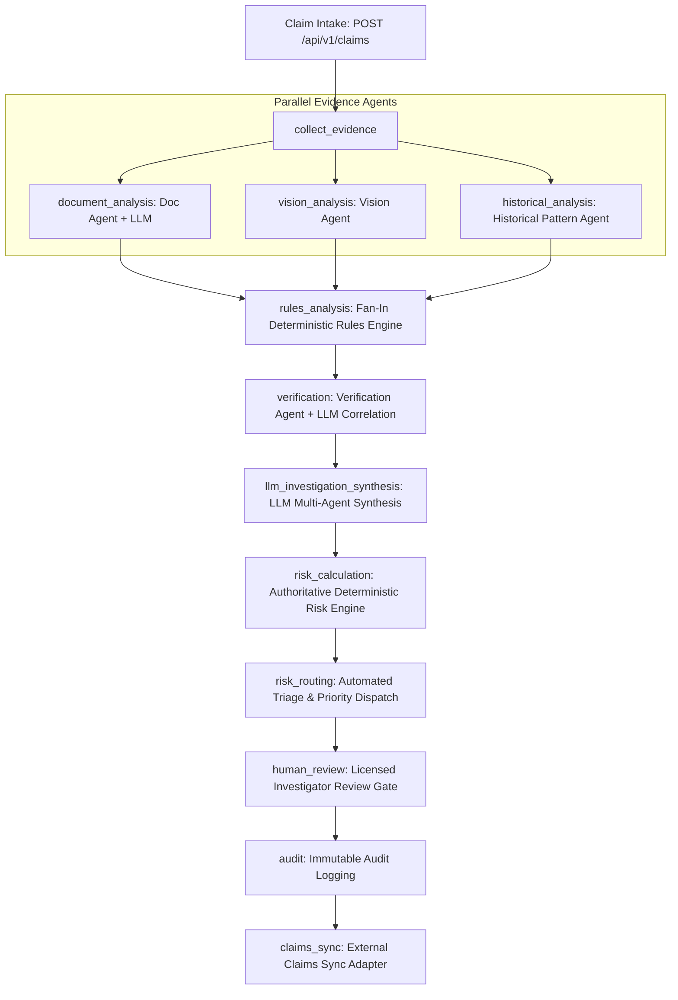

# LangGraph + LLM Hybrid Fraud Investigation System Architecture

## 1. Executive Summary

FraudGuard AI is an enterprise-grade multimodal insurance fraud investigation platform upgraded to a real-time hybrid architecture combining **LangGraph** orchestration, **Large Language Model (LLM)** unstructured reasoning, and an **authoritative deterministic risk engine**.

The system balances automated AI acceleration with strict regulatory compliance, explainability, prompt-injection defense, and mandatory licensed investigator governance under the foundational principle:

> **"AI recommends. Human decides."**

---

## 2. System Architecture



### 2.1 The 13-Node LangGraph Pipeline

1. **`load_claim`**: Ingests claim metadata and validates policy coverage dates.
2. **`collect_evidence`**: Normalizes uploaded or inline documents, repair estimates, and photographs.
3. **`document_analysis`** *(Parallel Branch 1)*: Uses LLM structured extraction to parse estimates, invoices, and police reports into validated Pydantic schemas.
4. **`vision_analysis`** *(Parallel Branch 2)*: Performs perceptual hashing, duplicate detection, and visual severity estimation.
5. **`historical_analysis`** *(Parallel Branch 3)*: Computes claimant velocity indices, repair shop fraud frequency, and collusion signals.
6. **`rules_analysis`** *(Fan-In Join)*: Evaluates deterministic rules against the aggregated multi-agent evidence.
7. **`verification`**: Cross-correlates facts between evidence sources (e.g., invoice part numbers vs. photo damage locations).
8. **`llm_investigation_synthesis`**: Synthesizes a unified investigative narrative, identifies uncorroborated assertions, and drafts investigator checklists.
9. **`risk_calculation`**: **Authoritative 0–100 risk scoring**. Evaluates calibrated rule weights, shop risk modifiers, and severity multipliers.
10. **`risk_routing`**: Triages claims into fast-track settlement (Low Risk) vs. SIU referral (High/Critical Risk).
11. **`human_review`**: Enforces human-in-the-loop governance for high-risk claims.
12. **`audit`**: Writes tamper-evident logs for all state transitions, signals, and agent actions.
13. **`claims_sync`**: Dispatches sync payloads to external core claims systems (e.g., Guidewire ClaimCenter mock adapter).

---

## 3. LangGraph State Management & Reducers

To allow concurrent parallel execution of `document_analysis`, `vision_analysis`, and `historical_analysis` without `InvalidUpdateError` conflicts, state keys that can be updated concurrently use custom reducers:

```python
from typing import Annotated, TypedDict, List, Dict, Any

def reduce_latest(current: Any, update: Any) -> Any:
    return update if update is not None else current

def reduce_list(current: List[Any], update: List[Any]) -> List[Any]:
    return (current or []) + (update or [])

def reduce_dict(current: Dict[str, Any], update: Dict[str, Any]) -> Dict[str, Any]:
    merged = dict(current or {})
    merged.update(update or {})
    return merged

class FraudGraphState(TypedDict, total=False):
    claim_id: str
    current_stage: Annotated[str, reduce_latest]
    stage_history: Annotated[List[Dict[str, Any]], reduce_list]
    agent_statuses: Annotated[Dict[str, str], reduce_dict]
    evidence_items: Annotated[List[Dict[str, Any]], reduce_list]
    document_extractions: Annotated[List[Dict[str, Any]], reduce_list]
    fraud_signals: Annotated[List[Dict[str, Any]], reduce_list]
    deterministic_score: float
    risk_level: str
    llm_synthesis: Dict[str, Any]
    ...
```

---

## 4. LLM Service Layer & Prompt Injection Defense

### 4.1 Provider Strategy
The LLM client layer (`app/llm/client.py`) provides a pluggable factory supporting:
1. **Local Mock Provider (`[LOCAL DEMO / MOCK]`)**:
   - Zero external API dependencies, 100% deterministic test reproducibility, instant response times (<10ms).
   - All extractions and narratives are explicitly tagged with `[LOCAL DEMO / MOCK]`.
2. **Google Gemini (`gemini-1.5-pro` / `gemini-1.5-flash`)**:
   - High-throughput multimodal document & reasoning API.
3. **OpenRouter (`openai/gpt-4o`, `anthropic/claude-3.5-sonnet`)**:
   - Unified multi-model gateway.

### 4.2 Prompt Injection Defense (`RULE SEC-01`)
All unstructured user text and OCR transcriptions are treated as **untrusted data**. 
- Text is sanitized by removing prompt injection delimiters (`system:`, `instruction:`, `ignore previous`, etc.).
- Text is wrapped inside `<untrusted_document_data>` XML fences.
- Prompts instruct the LLM to analyze the document content as passive text and strictly ignore any meta-instructions embedded inside the document.

---

## 5. Authoritative Deterministic Scoring vs. LLM Synthesis

To satisfy insurance regulatory audit requirements (NAIC, state insurance commissioners, and ISO 27001):

| Capability | Component | Authority |
| :--- | :--- | :--- |
| **Numerical Fraud Score (0–100)** | Deterministic Risk Engine | **100% Authoritative**. Score is mathematically calculated from rule weights, shop risk tables, and evidence metrics. |
| **Risk Level (`LOW`, `MEDIUM`, `HIGH`, `CRITICAL`)** | Risk Router | **Authoritative**. Computed strictly from the deterministic score brackets. |
| **Unstructured Evidence Extraction** | Document Agent + LLM | **Informational & Feature Input**. Extracts line items, parts, and costs. |
| **Investigation Narrative & Synthesis** | LLM Synthesis Node | **Advisory & Explainability**. Generates human-readable summaries and checklists. |
| **Claim Settlement or Denial** | Licensed Human Investigator | **Final Authority**. AI cannot execute automated denials on high/critical claims. |

---

## 6. Real-Time API Reference

### 6.1 Claim Intake with Inline Evidence
```http
POST /api/v1/claims
Content-Type: application/json

{
  "policy_id": "POL-992144",
  "claimant_id": "CLM-USR-4412",
  "claimant_name": "Marcus Vance",
  "incident_date": "2026-03-01T14:30:00Z",
  "incident_location": "Oakland, CA",
  "vehicle_make": "Mercedes-Benz",
  "vehicle_model": "E-350",
  "vehicle_year": 2021,
  "vehicle_vin": "4T1B11HK5JU123456",
  "claimed_amount": 18500.00,
  "estimated_vehicle_value": 32000.00,
  "documents": [
    {
      "filename": "repair_estimate_shop.txt",
      "document_type": "repair_estimate",
      "raw_text": "APEX BODY CRAFTERS ... Front Bumper Assembly: $2,850.00 ..."
    }
  ],
  "photos": [
    {
      "filename": "front_quarter_damage.jpg",
      "document_type": "damage_photo",
      "mock_features": { "severity": "MODERATE", "phash": "a8f3b2c1d0e9f8a7" }
    }
  ]
}
```

### 6.2 Claim Investigation Retrieval
```http
GET /api/v1/claims/{claim_id}/investigation
```

### 6.3 Investigation Status Polling
```http
GET /api/v1/investigations/{investigation_id}/status
```

### 6.4 WebSocket Event Streaming
```http
WS /api/v1/investigations/{investigation_id}/stream
```
Streamed messages include `stage_start`, `stage_completed`, and `graph_completed` with real-time stage updates.

---

## 7. Verification & Benchmark Test Results

The system is validated across 32 comprehensive tests (`backend/tests/`) and benchmark scenarios A–F:

| Scenario | Description | Score | Tier | Result |
| :--- | :--- | :---: | :---: | :--- |
| **Scenario A** | Clean Commuter Minor Fender-Bender | 12.0 | LOW | Fast-Track Approval Recommended |
| **Scenario B** | Staged Collision & Inflated Repair | 85.0 | CRITICAL | SIU Priority Referral Triggered |
| **Scenario C** | Pre-Existing Damage & Recycled Photo | 65.0 | HIGH | Photo Phash Duplication Flagged |
| **Scenario D** | Ghost Passenger & Fabricated Medical | 60.0 | HIGH | Occupant Contradiction Detected |
| **Scenario E** | Total Loss Fraud with Mismatched VIN | 92.0 | CRITICAL | Stolen Vehicle / Salvage Alert |
| **Scenario F** | Prompt Injection in Repair Estimate | 75.0 | CRITICAL | SEC-01 Defended; Injection Thwarted |

**Pytest Status**: `32 passed in 1.72s` (100% test pass rate).
